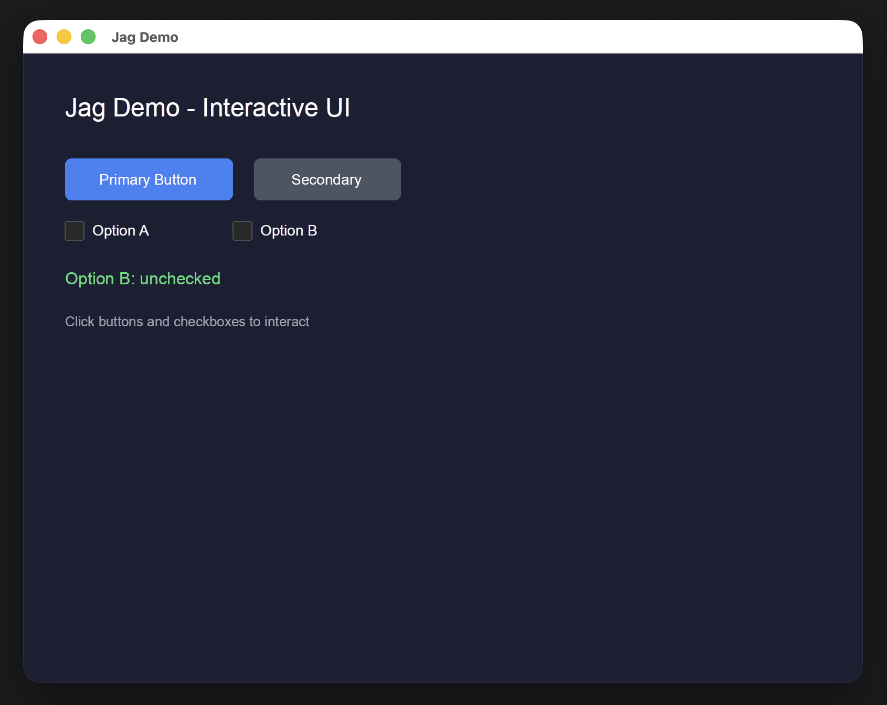

# Jag

GPU-accelerated 2D rendering and UI toolkit for Rust.

Build interactive UIs with composable elements, GPU-powered rendering via wgpu, and automatic flex/grid layout via Taffy.



## Crates

| Crate | Description |
|-------|-------------|
| [`jag`](https://crates.io/crates/jag) | Meta-crate re-exporting `jag-draw`, `jag-ui`, and `jag-surface` |
| [`jag-draw`](https://crates.io/crates/jag-draw) | Low-level GPU 2D renderer (display list, painter, pass manager) |
| [`jag-ui`](https://crates.io/crates/jag-ui) | UI elements, widgets, events, focus, and Taffy-based layout |
| [`jag-surface`](https://crates.io/crates/jag-surface) | Canvas-style drawing API on top of `jag-draw` |

## Quick Start

```toml
[dependencies]
jag = "0.1"
winit = "0.30"
pollster = "0.3"
```

```rust
use jag::draw::{JagTextProvider, SubpixelOrientation, Rect};
use jag::surface::JagSurface;
use jag::ui::elements::{Button, Checkbox, Text, Element};
use jag::ui::Theme;

// Create elements
let theme = Theme::default();
let mut btn = Button::with_theme("Click me", &theme);
btn.rect = Rect { x: 40.0, y: 100.0, w: 160.0, h: 40.0 };

// Render to a canvas
btn.render(&mut canvas, 10);
```

## Features

- **GPU-accelerated rendering** — wgpu backend with display list batching
- **19 UI elements** — Button, InputBox, TextArea, Checkbox, Radio, Select, ToggleSwitch, Slider, DatePicker, Link, Container, Card, Modal, Alert, Badge, Table, Image, Text
- **Widgets** — TextInput, TabBar, PopupMenu with built-in state management
- **Event handling** — Mouse, keyboard, and scroll events with hit testing
- **Focus management** — Tab navigation with configurable tab indices
- **Theming** — Dark/Light modes with customizable colors
- **Layout** — Taffy-based flex and grid layout
- **Text rendering** — System font loading, shaping (harfrust), rasterization (swash), subpixel rendering
- **Canvas API** — Higher-level drawing with rounded rects, images, gradients, SVG, shadows

## Running the Demo

```bash
git clone https://github.com/jag-rs/jag.git
cd jag
cargo run -p jag-demo
```

## Architecture

```
jag (meta-crate)
├── jag-draw     — GPU renderer (wgpu display list pipeline)
│   ├── jag-shaders  — WGSL shader modules
│   └── jag-text     — Text layout and shaping engine
├── jag-surface  — Canvas API (fill_rect, draw_text, images, etc.)
└── jag-ui       — UI elements, widgets, events, layout
```

## License

MIT License. See [LICENSE-MIT](LICENSE-MIT) for details.

## Contributing

Contributions are welcome! Please open an issue or pull request on [GitHub](https://github.com/jag-rs/jag).
